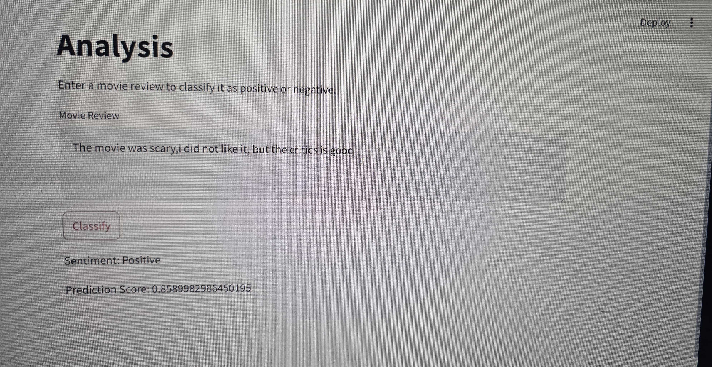

# MovieReviewAnalysis Using RNN

## Table of Contents

## Table of Contents

1. [About The Project](#about-the-project)
2. [Built_With](#Built-with)
   - [Prerequisites](#prerequisites)
   - [Installation](#installation)
3. [Usage](#usage)
4. [References](#references)
5. [Contact](#contact)

---

## About The Project

This project implements a sentiment analysis system for IMDB movie reviews using a Recurrent Neural Network (RNN), specifically a simple RNN model built with Keras/TensorFlow.  The project loads a pre-trained RNN model (simple_rnn_model.h5) and uses it to classify movie reviews as positive or negative.

The code includes a Streamlit application that provides a user-friendly interface.  Users can enter a movie review in a text area, and upon clicking the "classify" button, the application uses the loaded model to predict the sentiment of the review.

A SentimentAnalyzer class (defined in src/util.py, not shown here) likely handles the text preprocessing and prediction logic.  This class takes the loaded model and the user input as arguments. The predict method of the SentimentAnalyzer class performs the following steps:

**Preprocessing**: The input movie review is preprocessed. This typically involves cleaning the text (removing special characters, HTML tags, etc.), tokenizing it (splitting it into words), and converting the words into numerical indices using a reverse_word_index (also not shown, but likely loaded from a file).  This reverse_word_index is crucial for converting the numerical output of the model back into human-readable words.  The preprocessed text is then passed to the model for prediction.

**Prediction**: The preprocessed text is fed to the loaded RNN model (simple_rnn_model.h5) to generate a sentiment prediction. The model outputs a probability (between 0 and 1) indicating the likelihood of the review being positive (or negative, depending on how the model is trained).

**Output**: The Streamlit app displays the predicted sentiment (positive or negative) based on the probability, and also shows the prediction score (the probability value).

The project demonstrates a basic but functional example of sentiment analysis using RNNs.  It highlights the use of Keras/TensorFlow for building and loading RNN models and Streamlit for creating interactive web applications.  The project can be expanded by using more sophisticated RNN architectures (LSTMs, GRUs, or bidirectional RNNs), incorporating pre-trained word embeddings, or improving the user interface.  The inclusion of the SentimentAnalyzer class suggests a well-structured approach to the project, separating the model logic from the Streamlit application code.

---

## Built With

The tools that have been used in the project are:

- **Python**
- **Tensor Flow**
- **Streamlit**
- **RNN's**

  ### Prerequisites

  - **Python 3.7+** (Recommended: 3.8 or 3.9)
  - **Tensor Flow**
  - **StreamLit**
 
  
### Usage
1. **Market Research**
2. **Reputation Management**

### References
[https://ieeexplore.ieee.org/document/10128450/](https://ieeexplore.ieee.org/document/10128450/).

### Contact
### _Pramathesh T S_

**Email ID** - pramatheshts025@gmail.com 
**LinkedIn** - [https://www.linkedin.com/in/pramatheshts1999/](https://www.linkedin.com/in/pramatheshts1999/) 
**GitHub**   - [https://github.com/Pramathesh690/](https://github.com/Pramathesh690/)
